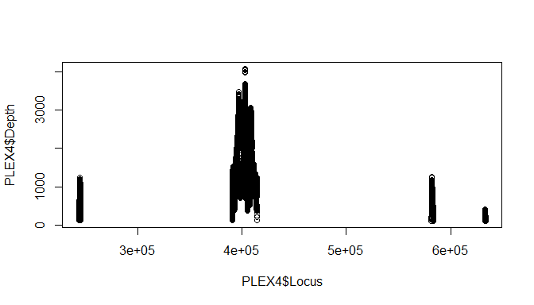
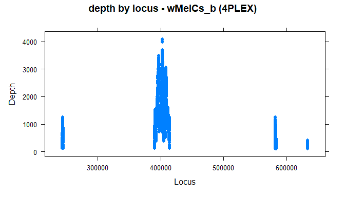
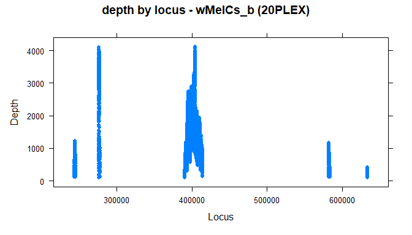
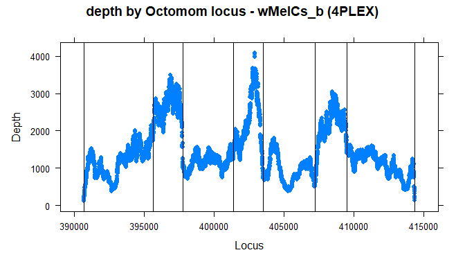
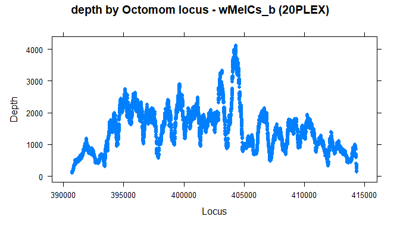

------------------------------------------------------------------------

output: github\_document: default pdf\_document: fig\_caption: no
html\_document: df\_print: paged ’’: default header-includes: -
-   

-   

-   

-   

-   

-   fontsize: 11pt params: name: Migla Miskinyte date: ‘2022-01-27’
    description: Coverage analysis PLEx4 and PLEX20 data:
    folders/HMI/Migla/data/2022/January

------------------------------------------------------------------------

``` r
library(reshape2)
library(lattice, pos=10)
library(tibble)
library(latticeExtra)
```

``` r
PLEX4 <- read.table("Z:/variant/results/bam/4PLEXfiltered.coverage",header=FALSE, sep="\t", na.strings="NA",dec=".", strip.white=TRUE)

PLEX20 <- read.table("Z:/variant/results/bam/20PLEXfiltered.coverage",header=FALSE, sep="\t", na.strings="NA",dec=".", strip.white=TRUE)
```

``` r
PLEX4<-reshape::rename(PLEX4,c(V1="Genome", V2="Locus", V3="Depth")) 

PLEX20<-reshape::rename(PLEX20,c(V1="Genome", V2="Locus", V3="Depth"))
```

``` r
#PLEX4
```

``` r
plot(PLEX4$Locus, PLEX4$Depth)
```

<!-- -->

``` r
xyplot(Depth ~ Locus, type="p", pch=16, auto.key=list(border=TRUE), par.settings=simpleTheme(pch=16), scales=list(x=list(relation='same'), y=list(relation='same')), data=PLEX4, main="depth by locus - wMelCs_b (4PLEX)")
```

<!-- -->

``` r
xyplot(Depth ~ Locus, type="p", pch=16, auto.key=list(border=TRUE), par.settings=simpleTheme(pch=16), scales=list(x=list(relation='same'), y=list(relation='same')), data=PLEX20, main="depth by locus - wMelCs_b (20PLEX)")
```

<!-- -->

``` r
Octomom4PLEX <- subset(PLEX4, Locus >= 390657 & Locus < 414388, select=c(Genome, Locus, Depth))

Octomom20PLEX <- subset(PLEX20, Locus >= 390657 & Locus < 414388, select=c(Genome, Locus, Depth))
```

``` r
primers <-subset.data.frame(Octomom4PLEX, Locus == 407227 | Locus == 414387 | Locus == 401380 | Locus == 409512 | Locus == 395636 | Locus == 403526 | Locus == 390657 | Locus == 397771, select=c(Genome, Locus, Depth))
primers
```

    ##           Genome  Locus Depth
    ## 1795  CP046924.1 390657   120
    ## 6774  CP046924.1 395636  1764
    ## 8909  CP046924.1 397771  1022
    ## 12518 CP046924.1 401380  1272
    ## 14664 CP046924.1 403526   788
    ## 18365 CP046924.1 407227   545
    ## 20650 CP046924.1 409512  1581
    ## 25525 CP046924.1 414387   128

``` r
xyplot(Depth ~ Locus, type="p", pch=16, auto.key=list(border=TRUE), par.settings=simpleTheme(pch=16), scales=list(x=list(relation='same'), y=list(relation='same')), data=Octomom4PLEX, main="depth by Octomom locus - wMelCs_b (4PLEX)") +layer(panel.abline(v = Locus), data = primers)
```

<!-- -->

``` r
xyplot(Depth ~ Locus, type="p", pch=16, auto.key=list(border=TRUE), par.settings=simpleTheme(pch=16), scales=list(x=list(relation='same'), y=list(relation='same')), data=Octomom20PLEX, main="depth by Octomom locus - wMelCs_b (20PLEX)")
```

<!-- -->
